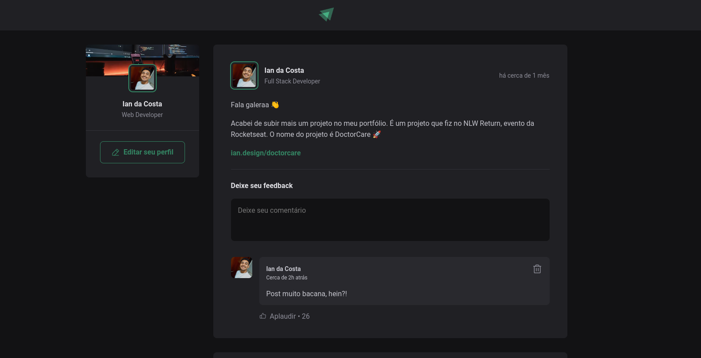

# Ignite Feed

Um Feed de uma rede social desenvolvida em Typescript

## Layout

## Installation and Setup Instructions

Clone o repositório. Será necessário `node` e `npm` instalados em sua máquina.

Instalação:

`npm install`

To Start Server:

`npm run dev`

Visite o App:

`localhost:3001/`
